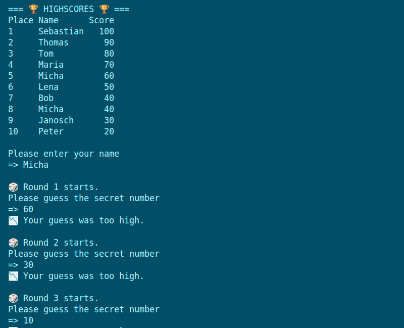
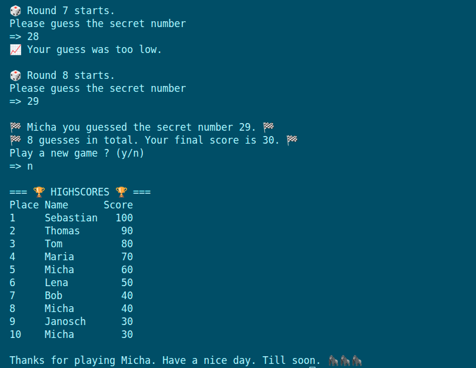

# fcc-guessing-game

freeCodeCamp - Python Course Exercise: Guessing Game

ℹ️ Description

Just a small exercise to practice very basic concepts in Python.

- Load/Save and displays highscores.
- Enter your name.
- Guess the secret number.
- Score will be reduced after false guess.
- Messages after each wrong guess will say if guess was too high or low.
- If score hits 0, it's Game Over.
- If guess is correct, name and score are saved in highscores.
- Displays top 10 Highscores.

✅ Features

- saves name and score
- displays top 10
- creates random number
- messages for too low or high guesses

⚙️ Tech Stack

    

📸 Screenshots

<figure>
    
    <figcaption>Game Start: Leaderboard and First Guesses</figcaption>
</figure>

<figure>
    
    <figcaption>Game End: Result and Updated High Scores</figcaption>
</figure>
